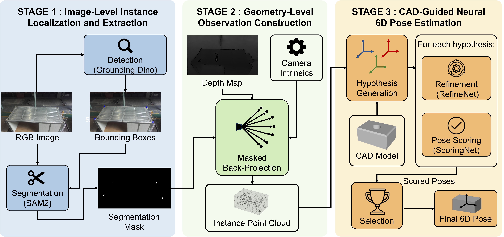
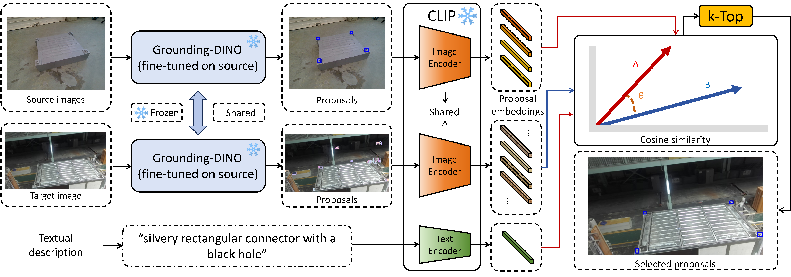

# Vision-based Assembly Target Pose Estimation and Adaptation for Robotic Assembly in Modular Integrated Construction

[Paper](https://www.sciencedirect.com/science/article/pii/S0926580526005005) | [Dataset](#dataset) | [Citation](#citation)

## Introduction
Modular Integrated Construction (MiC) accelerates building processes, yet the positioning and alignment of MiC modules on-site remain hazardous and labor-intensive. This paper formulates the robotic perception task for automated MiC module assembly as the pose estimation of assembly targets, which are categorized as either convex or concave structures. A coarse-to-fine pose estimation (C2FPE) method is proposed, where targets are detected and segmented from RGB images for coarse localization, followed by fine-grained pose estimation using RGB-D data. To address the domain gap between laboratory and construction-site environments, a training-free, multi-modal pose adaptation (T2MPA) method is introduced, enabling a pre-trained detection model to be transferred to real-world construction scenarios without manual annotation. 
## Method
Rather than directly learning to regress pose from data, pose estimation is formulated as a coarse-to-fine inference process that progressively constrains pose ambiguity from image-level localization to geometry-level alignment. The C2FPE framework decomposes the process into three stages: image-level instance localization and extraction, geometry-level observation construction, and CAD-guided neural pose inference. It first localizes assembly targets using RGB-based detection and segmentation, and then performs geometry-driven pose estimation from RGB-D observations through CAD-based hypothesis generation and iterative refinement.

<p align="center">
  <br/>
  <em><sub>C2FPE framework.</sub></em>
</p>

The domain gap between controlled laboratory and real-world construction-site conditions is a major challenge for deploying visual perception models. T2MPA bridges this gap without model retraining or fine-tuning on target-domain data. It generates reliable candidate proposals for downstream 6-DoF pose estimation by multi-modal alignment between source-domain exemplars and target-domain observations.

<p align="center">
  <br/>
  <em><sub>T2MPA framework.</sub></em>
</p>

## Dataset
The dataset contains RGB-D images of convex and concave assembly targets. Convex targets are protruding rectangular connectors. Concave targets are recessed rectangular grooves.

[Download](https://pan.baidu.com/s/1VuqFPsu-605deb5dvjs0kw?pwd=8p7y)

## Citation
Please cite our work if you find the dataset useful.
```
@article{QI2026107259,
  title = {Vision-based assembly target pose estimation and adaptation for robotic assembly in Modular Integrated Construction},
  journal = {Automation in Construction},
  volume = {192},
  pages = {107259},
  year = {2026},
  issn = {0926-5805},
  doi = {https://doi.org/10.1016/j.autcon.2026.107259},
  author = {Yuanyang Qi and Jie Hong and Tingtian Li and Chen Qian and Xiao Li and Geoffrey Qiping Shen},
}
```
