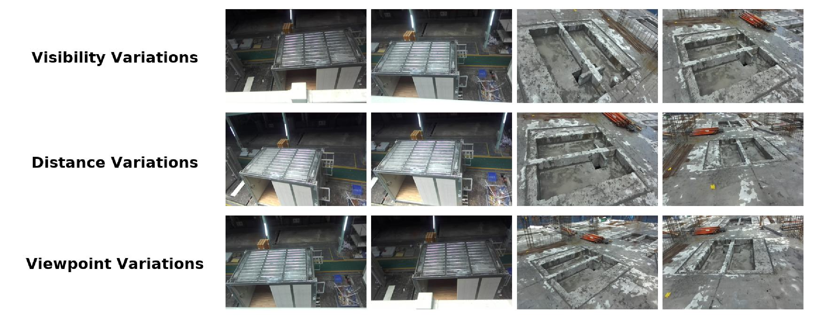

# Vision-based Assembly Target Pose Estimation and Adaptation for Robotic Assembly in Modular Integrated Construction

## Dataset

[Download](https://pan.baidu.com/s/1VmMrQzGJpBLb8-6R132YYA?pwd=irib)

We release construction-site RGB-D datasets of **convex** and **concave** assembly targets. Convex targets are protruding rectangular connectors; concave targets are recessed rectangular grooves. Data were captured with a ZED 2i (1280×720).

   
  <em>Sample images from the construction-site datasets (visibility / distance / viewpoint variations).</em>

